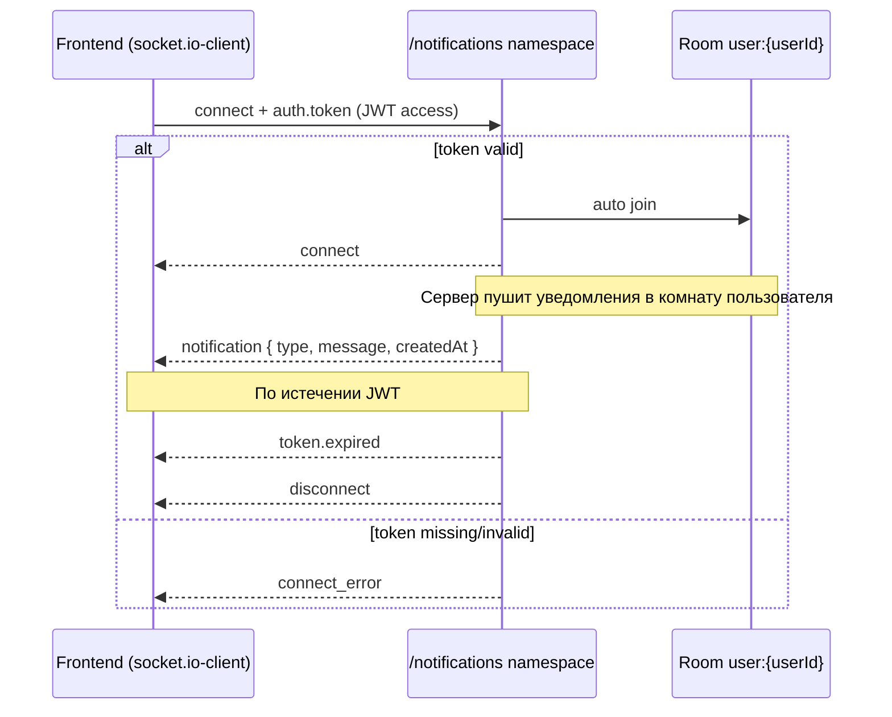

# WebSocket-уведомления (контракт для фронтенда)

Документация описывает, как фронтенд подключается к серверу уведомлений, какие события слушать и как обрабатывать payload. Внутренняя бэкенд-логика (очереди, RabbitMQ, процессоры) здесь не рассматривается.

**Стек на сервере:** [Socket.IO](https://socket.io/) v4 (не «голый» WebSocket). Клиент должен использовать `socket.io-client`.

---

## Часть 1. Пошаговый гайд по интеграции

### Шаг 1. Установите клиент

```bash
npm install socket.io-client
```

### Шаг 2. Получите access token

Для подключения нужен **JWT access token** — тот же, что возвращается при логине / refresh (`accessToken` в теле ответа REST API). Refresh token в cookie для WebSocket **не используется**.

### Шаг 3. Подключитесь к namespace `notifications`

```typescript
import { io, Socket } from 'socket.io-client';

const API_BASE_URL = process.env.NEXT_PUBLIC_API_BASE_URL!; // например https://api.example.com

const socket: Socket = io(`${API_BASE_URL}/notifications`, {
  auth: {
    token: accessToken, // предпочтительный способ
  },
  // альтернатива: extraHeaders: { token: accessToken }, // только если транспорт поддерживает заголовки
  autoConnect: true,
  reconnection: true,
});
```

| Параметр              | Значение                                 |
| --------------------- | ---------------------------------------- |
| URL                   | `{PUBLIC_API_BASE_URL}/notifications`    |
| Namespace             | `/notifications`                         |
| Префикс REST `api/v1` | **не** входит в URL WebSocket            |
| Транспорт             | Socket.IO (websocket + polling fallback) |

### Шаг 4. Подписка — автоматическая

Отдельного сообщения «подписаться» отправлять **не нужно**. После успешной аутентификации сервер сам добавляет сокет в комнату текущего пользователя. Все события `notification` приходят только для залогиненного пользователя.

### Шаг 5. Слушайте события

```typescript
// Успешное подключение
socket.on('connect', () => {
  console.log('WS connected', socket.id);
});

// Основное событие — новое уведомление
socket.on('notification', (payload: NotificationWebSocketPayload) => {
  console.log('New notification', payload);
  // показать toast, обновить счётчик, добавить в список и т.д.
});

// Access token истёк — нужно обновить токен и переподключиться
socket.on('token.expired', () => {
  console.warn('Access token expired on WS');
  // refresh access token → socket.auth = { token: newToken } → socket.connect()
});

// Ошибка подключения (в т.ч. невалидный/отсутствующий токен)
socket.on('connect_error', (error: Error) => {
  console.error('WS connect error', error.message);
});

socket.on('disconnect', (reason) => {
  console.log('WS disconnected', reason);
});
```

### Шаг 6. React-хук (рекомендуемый паттерн)

```typescript
// hooks/useNotificationsSocket.ts
import { useCallback, useEffect, useRef, useState } from 'react';
import { io, Socket } from 'socket.io-client';
import type { NotificationWebSocketPayload } from '../types/notifications';

type UseNotificationsSocketOptions = {
  apiBaseUrl: string;
  getAccessToken: () => string | null;
  onNotification: (notification: NotificationWebSocketPayload) => void;
  onTokenExpired?: () => Promise<string | null>;
  enabled?: boolean;
};

export function useNotificationsSocket({
  apiBaseUrl,
  getAccessToken,
  onNotification,
  onTokenExpired,
  enabled = true,
}: UseNotificationsSocketOptions) {
  const socketRef = useRef<Socket | null>(null);
  const [isConnected, setIsConnected] = useState(false);
  const [lastError, setLastError] = useState<string | null>(null);

  const connect = useCallback(async () => {
    const token = getAccessToken();
    if (!token) return;

    socketRef.current?.disconnect();

    const socket = io(`${apiBaseUrl}/notifications`, {
      auth: { token },
      autoConnect: true,
      reconnection: true,
    });

    socket.on('connect', () => {
      setIsConnected(true);
      setLastError(null);
    });

    socket.on('disconnect', () => setIsConnected(false));

    socket.on('connect_error', (error: Error) => {
      setLastError(error.message);
    });

    socket.on('notification', onNotification);

    socket.on('token.expired', async () => {
      socket.disconnect();
      if (!onTokenExpired) return;

      const newToken = await onTokenExpired();
      if (!newToken) return;

      socket.auth = { token: newToken };
      socket.connect();
    });

    socketRef.current = socket;
  }, [apiBaseUrl, getAccessToken, onNotification, onTokenExpired]);

  useEffect(() => {
    if (!enabled) {
      socketRef.current?.disconnect();
      socketRef.current = null;
      setIsConnected(false);
      return;
    }

    void connect();

    return () => {
      socketRef.current?.disconnect();
      socketRef.current = null;
    };
  }, [connect, enabled]);

  return { isConnected, lastError, reconnect: connect };
}
```

**Использование в компоненте:**

```tsx
function NotificationProvider({ children }: { children: React.ReactNode }) {
  const { accessToken, refreshAccessToken } = useAuth();

  useNotificationsSocket({
    apiBaseUrl: process.env.NEXT_PUBLIC_API_BASE_URL!,
    getAccessToken: () => accessToken,
    onNotification: (n) => showToast(n.message),
    onTokenExpired: refreshAccessToken,
    enabled: Boolean(accessToken),
  });

  return <>{children}</>;
}
```

### Шаг 7. Обработка уведомлений в UI

Рекомендуемый минимальный flow:

1. При `notification` — показать toast / badge и добавить запись в локальный стейт.
2. По `type` — выбрать иконку, цвет, CTA (например, «Продлить подписку»).
3. `message` уже содержит готовый текст на русском — можно показывать как есть.
4. `createdAt` — для сортировки и отображения времени.

---

## Часть 2. Справочная документация

### Архитектура (вид с фронтенда)



Клиент **ничего не отправляет** для подписки. Модель: **connect → слушать `notification`**.

---

### Подключение

| Параметр       | Значение                              |
| -------------- | ------------------------------------- |
| Протокол       | Socket.IO v4 поверх HTTP(S)           |
| Namespace      | `/notifications`                      |
| Полный URL     | `{PUBLIC_API_BASE_URL}/notifications` |
| Пример (local) | `http://localhost:3000/notifications` |
| CORS           | Разрешены все origin (`*`)            |

#### Аутентификация

JWT **access token** передаётся при handshake. Поддерживаются два варианта (достаточно одного):

| Способ                 | Где передавать                 | Рекомендация        |
| ---------------------- | ------------------------------ | ------------------- |
| `auth.token`           | `io(url, { auth: { token } })` | **Предпочтительно** |
| HTTP-заголовок `token` | `extraHeaders: { token }`      | Запасной вариант    |

Токен проверяется тем же секретом и правилами, что и REST Bearer JWT. В payload токена используются поля `userId`, `iat`, `exp`.

**Не подходит:** refresh token, API keys, заголовок `Authorization: Bearer ...` (в текущей реализации не читается).

---

### События: сервер → клиент

#### `notification`

Основное событие. Приходит, когда для текущего пользователя создано новое уведомление.

**Payload:**

```typescript
interface NotificationWebSocketPayload {
  type: NotificationType;
  message: string;
  createdAt: string; // ISO 8601, например "2026-06-11T12:34:56.789Z"
}
```

| Поле        | Тип                | Описание                            |
| ----------- | ------------------ | ----------------------------------- |
| `type`      | `NotificationType` | Тип уведомления (см. ниже)          |
| `message`   | `string`           | Готовый текст для пользователя (RU) |
| `createdAt` | `string`           | Время создания записи в UTC (ISO)   |

> **Важно:** через WebSocket **не** передаются `id` и `payload` из БД. Для дедупликации используйте комбинацию `type` + `createdAt` или отдельный REST/GraphQL-эндпоинт истории (если появится).

#### Когда приходит каждый `type`

| `NotificationType`         | Когда генерируется                    | Пример `message`                                                                         |
| -------------------------- | ------------------------------------- | ---------------------------------------------------------------------------------------- |
| `SUBSCRIPTION_ACTIVATED`   | Подписка активирована                 | `Ваша подписка активирована и действует до {expireAt}`                                   |
| `SUBSCRIPTION_EXPIRING_7D` | До окончания подписки осталось 7 дней | `Ваша подписка истекает через 7 дней. Она истечет: {expireAt}`                           |
| `SUBSCRIPTION_EXPIRING_1D` | До окончания подписки остался 1 день  | `Ваша подписка истекает через 1 день. Она истечет: {expireAt}`                           |
| `NEXT_PAYMENT_1D`          | До следующего списания остался 1 день | `Следующий платеж у вас спишется через 1 день. Дата следующего платежа: {nextPaymentAt}` |

Даты в `message` (`expireAt`, `nextPaymentAt`) — строки в том формате, в котором их передала платёжная система.

#### `token.expired`

Сервер отправляет это событие **непосредственно перед принудительным отключением**, когда истекает срок действия access token (`exp` из JWT).

**Payload:** отсутствует.

**Ожидаемое действие клиента:**

1. Обновить access token (например, `POST /api/v1/auth/refresh-token`).
2. Установить новый токен: `socket.auth = { token: newAccessToken }`.
3. Вызвать `socket.connect()`.

#### Стандартные события Socket.IO

| Событие         | Когда                                 | Действие клиента                                                 |
| --------------- | ------------------------------------- | ---------------------------------------------------------------- |
| `connect`       | Успешное подключение и join в комнату | Можно считать WS «готовым»                                       |
| `disconnect`    | Соединение разорвано                  | Показать offline-состояние; при `token.expired` — обновить токен |
| `connect_error` | Ошибка handshake (чаще всего auth)    | См. раздел «Ошибки»                                              |

---

### События: клиент → сервер

**Кастомных событий нет.** Сервер не обрабатывает `@SubscribeMessage` — подтверждения доставки, ack и ручная подписка не требуются.

Клиент может отправлять только стандартные служебные пакеты Socket.IO (connect/disconnect), управляемые библиотекой.

---

### Типы данных (TypeScript)

Скопируйте на фронт или сгенерируйте из shared-пакета:

```typescript
/** Соответствует enum NotificationType в Prisma / @generated/prisma-snapflow */
export enum NotificationType {
  SUBSCRIPTION_ACTIVATED = 'SUBSCRIPTION_ACTIVATED',
  SUBSCRIPTION_EXPIRING_7D = 'SUBSCRIPTION_EXPIRING_7D',
  SUBSCRIPTION_EXPIRING_1D = 'SUBSCRIPTION_EXPIRING_1D',
  NEXT_PAYMENT_1D = 'NEXT_PAYMENT_1D',
}

/** Payload события `notification` */
export interface NotificationWebSocketPayload {
  type: NotificationType;
  message: string;
  createdAt: string;
}

/** JWT access token payload (для справки, не приходит по WS) */
export interface PayloadAccessToken {
  userId: number;
  iat: number;
  exp: number;
}
```

#### Type guards (опционально)

Если нужна валидация на клиенте:

```typescript
const NOTIFICATION_TYPES = new Set<string>(Object.values(NotificationType));

export function isNotificationWebSocketPayload(
  value: unknown,
): value is NotificationWebSocketPayload {
  if (typeof value !== 'object' || value === null) return false;

  const v = value as Record<string, unknown>;
  return (
    typeof v.message === 'string' &&
    typeof v.createdAt === 'string' &&
    typeof v.type === 'string' &&
    NOTIFICATION_TYPES.has(v.type)
  );
}
```

---

### Жизненный цикл соединения

#### Первое подключение

```
1. Клиент: io(url, { auth: { token } })
2. Сервер: проверка JWT в middleware
   ├─ нет токена      → connect_error "Unauthorized: No token provided"
   ├─ невалидный JWT  → connect_error "Unauthorized: Invalid token"
   └─ валидный JWT    → connect
3. Сервер: join комнаты user:{userId}
4. Сервер: запуск таймера отключения по exp токена
5. Клиент готов слушать notification
```

#### Во время сессии

- Уведомления приходят push-событием `notification` без запроса со стороны клиента.
- Несколько вкладок / устройств с одним пользователем — каждое подключение в одной комнате; **все** получат событие.

#### Истечение токена

```
1. Сервер: emit('token.expired')
2. Сервер: disconnect(true)
3. Клиент: refresh token → reconnect с новым auth.token
```

Если `exp` отсутствует или уже в прошлом при подключении — соединение сразу разрывается **без** `token.expired`.

#### Переподключение (reconnect)

Socket.IO по умолчанию переподключается с тем же `auth.token`. Если токен успел истечь:

- middleware отклонит handshake → `connect_error`;
- либо соединение установится и скоро получит `token.expired`.

**Рекомендация:** при `connect_error` с текстом `Unauthorized` и при `token.expired` всегда обновляйте access token перед reconnect.

#### Отключение пользователем

```typescript
socket.disconnect();
```

Сервер снимает таймер и логирует disconnect. Повторное подключение — с актуальным токеном.

---

### Обработка ошибок

| Ситуация                                  | Событие                          | `error.message` (типично)         | Что делать на фронте                                  |
| ----------------------------------------- | -------------------------------- | --------------------------------- | ----------------------------------------------------- |
| Токен не передан                          | `connect_error`                  | `Unauthorized: No token provided` | Не подключаться без логина; передать `auth.token`     |
| Токен невалиден / просрочен при handshake | `connect_error`                  | `Unauthorized: Invalid token`     | Refresh access token → reconnect                      |
| Токен истёк во время сессии               | `token.expired` → `disconnect`   | —                                 | Refresh → `socket.auth = { token }` → `connect()`     |
| Сеть / сервер недоступен                  | `connect_error` / auto-reconnect | Зависит от транспорта             | Показать offline; довериться `reconnection` Socket.IO |
| Невалидный payload (не должно случаться)  | —                                | —                                 | Игнорировать или залогировать; не падать              |

Пример централизованной обработки:

```typescript
function handleConnectError(
  error: Error,
  refreshToken: () => Promise<string | null>,
) {
  const msg = error.message ?? '';

  if (msg.startsWith('Unauthorized')) {
    void refreshToken().then((token) => {
      if (!token) return;
      socket.auth = { token };
      socket.connect();
    });
    return;
  }

  // прочие ошибки — логирование / UI
  console.error('Notifications WS error', msg);
}
```

---

### Минимальные примеры

#### Vanilla TypeScript

```typescript
import { io } from 'socket.io-client';

const socket = io(`${API_BASE_URL}/notifications`, {
  auth: { token: accessToken },
});

socket.on('notification', (data) => {
  if (!isNotificationWebSocketPayload(data)) return;
  appendToNotificationList(data);
});

socket.on('token.expired', async () => {
  const newToken = await refreshAccessToken();
  if (!newToken) return;
  socket.auth = { token: newToken };
  socket.connect();
});
```

#### Только слушать (без отправки сообщений)

```typescript
// Подписка не требуется — достаточно connect + on('notification')
socket.on('notification', console.log);
```

---

### Чеклист для фронтенда

- [ ] Используется `socket.io-client`, не нативный `WebSocket`
- [ ] URL: `{PUBLIC_API_BASE_URL}/notifications` (без `api/v1`)
- [ ] В handshake передаётся JWT **access** token через `auth.token`
- [ ] Обработаны события: `notification`, `token.expired`, `connect_error`, `disconnect`
- [ ] При истечении токена — refresh и reconnect с новым токеном
- [ ] UI реагирует на все четыре значения `NotificationType`
- [ ] Не ожидается `id` в WS-payload (если нужен — отдельный API истории)

---

### Зависимости окружения

| Переменная (бэкенд)   | Назначение для фронта                        |
| --------------------- | -------------------------------------------- |
| `PUBLIC_API_BASE_URL` | Базовый URL для `io(...)`                    |
| `PORT`                | Порт в local/dev (обычно тот же, что у REST) |

На фронте достаточно знать публичный URL API (`NEXT_PUBLIC_API_BASE_URL` или аналог).
